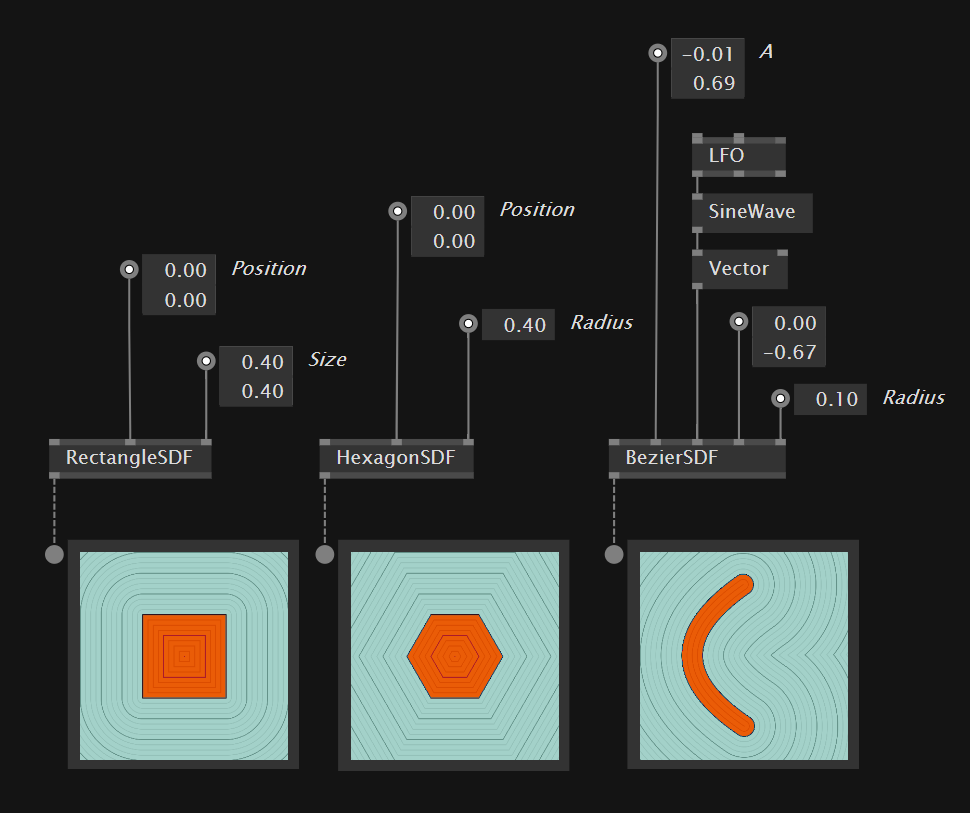
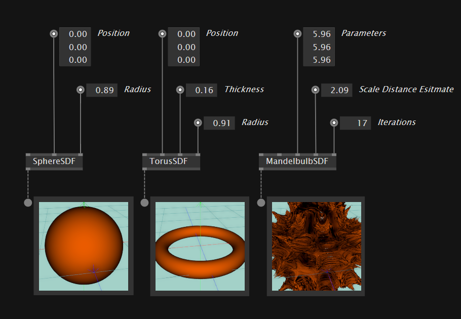
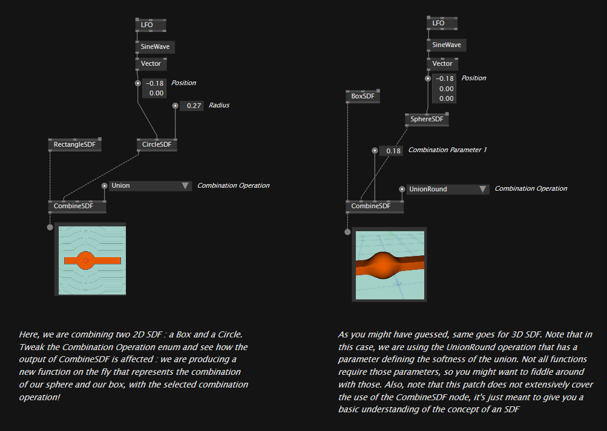
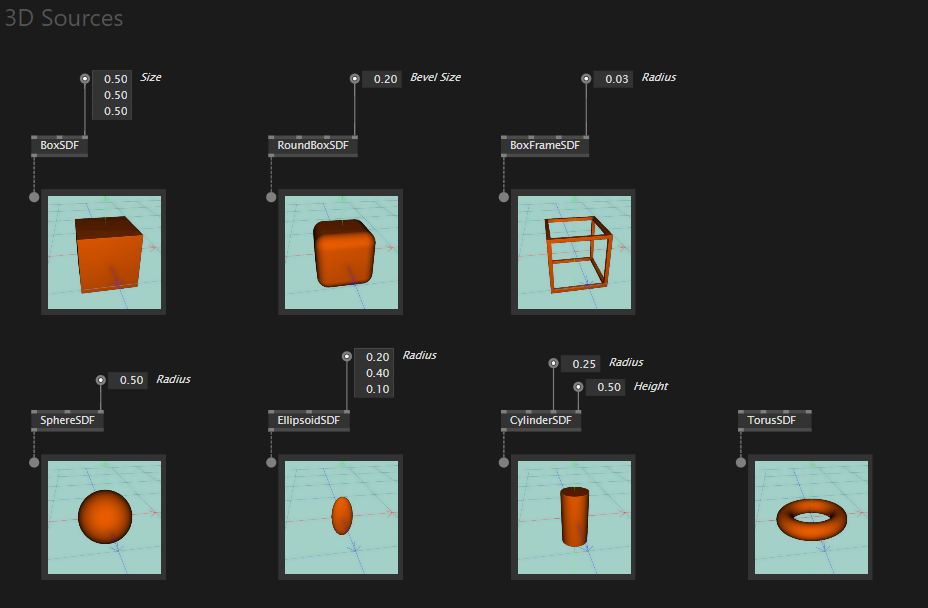
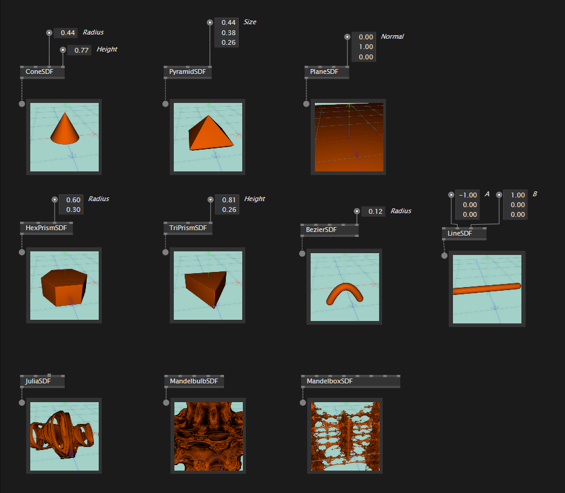
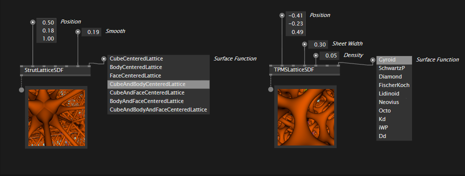
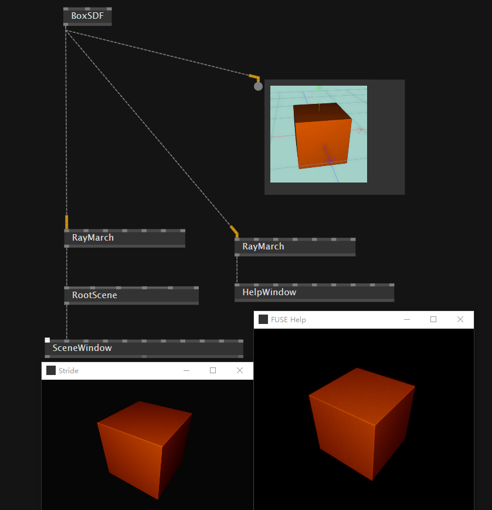
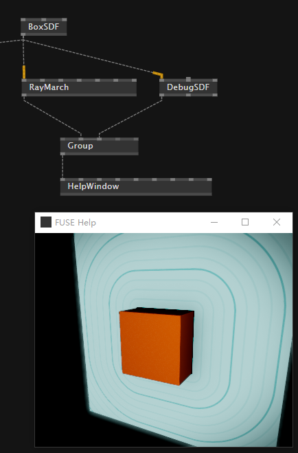

# signed disntance field

## 概念

中文名字叫有向距离场。

当然我们不需要那么深入去研究算法，可以先有一个大致的概念：

- SDF是一个场。场的意思是，物体（比如说粒子）可以在场中受到影响，可以与场进行交互
- SDF同时又可以用算法表示出复杂的2d，3d的场，甚至彼此可以叠加做波尔运算

3d图形同样可以这么理解：

因为是算法生成的图形，基本上也会支持各种布尔运算，这就带来了很多可能性：

上面的图式仅仅是图示，其实不存在这么一个物体，因为SDF说到底就是一个场

## 3D SDF Sources

但是以上这些更像是将这个场可视化出来，说到底还是一个场。所以并不知道是否真的可以将这些场作为模型来使用。

## RayMarch

- 通过Raymarching的方式，我们可以可视化SDF

- 与传统RayTrancy不同的是，RayMarching会计算在一条ray上面各个位置的distance，当distance变得非常非常小的时候，就说明这条ray与面发生了接触

  

  

- 大概了解了概念之后我们直接使用

  

- 节点DebugSDF将会可视化SDF的场

  
