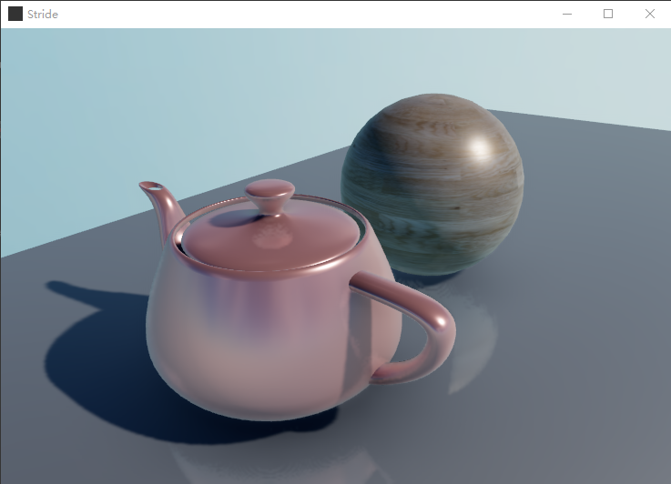
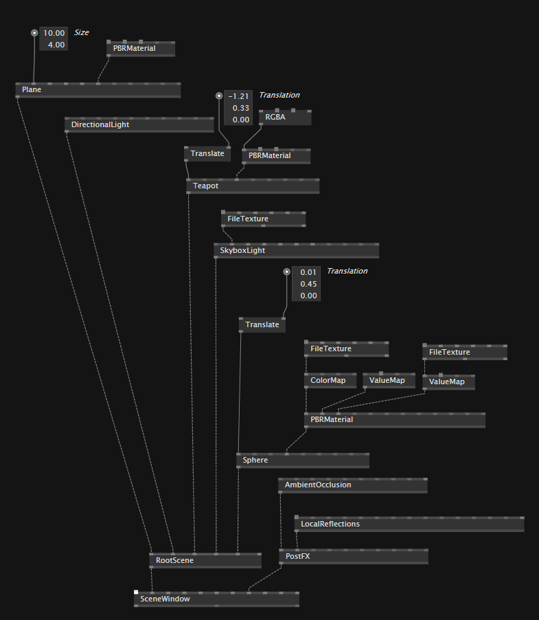
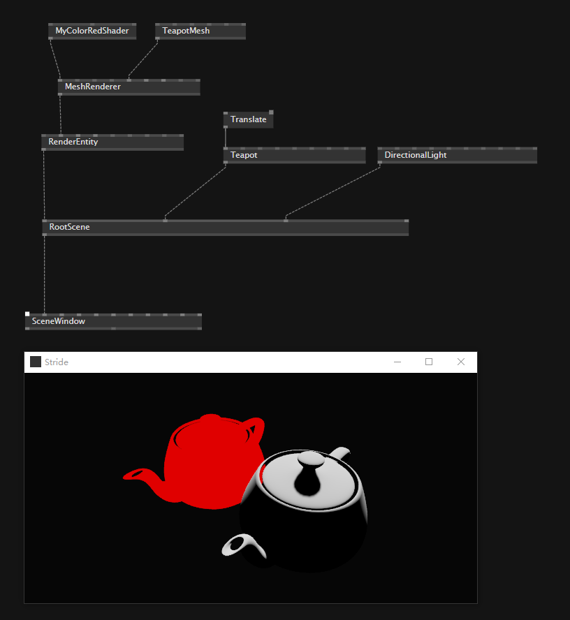

# Render

使用stride最基础的当然是渲染窗口，以及piple。

在vvvv这个版本中应该存在着两个层面的Render

- SceneWindow 处理高层级的渲染管线
- RenderWindow处理更底层级的渲染管线

## SceneWindow

这个是高层级的渲染，面向场景的控制，就像在unity中打开一个scene，处理的都是物体啊，灯光啊，这个层级的事情。

### 关键的结构

- SceneWindow
- RootScene——接收的都是 Entity
  - [Stride.Models]
    - Plane
    - Teapot
    - Sphere
  - [Stride.Lights]
    - DirectionalLight
    - SkyboxLight
  - ...
- PostFX——接收[Stride.Rendering.PostFX]
  - AmbientOcclusion
  - LocalRefections
- [Stride.Material]
  - PBRMaterial

## RenderWindow

处理更底层的渲染管线，这样就可以操作Shader等

### 关键节点

- MeshRenderer
- RenderWindow

## 两者的结合

操作底层的shader也是想要创造出一些可以在场景中使用的效果。

想要完成上面一步最主要的其实就是如何将shader导出成Entity，这样就能被接入场景了。

关键节点

- RenderEntity

当然似乎还有别的管线，这里先大概总结一下。
