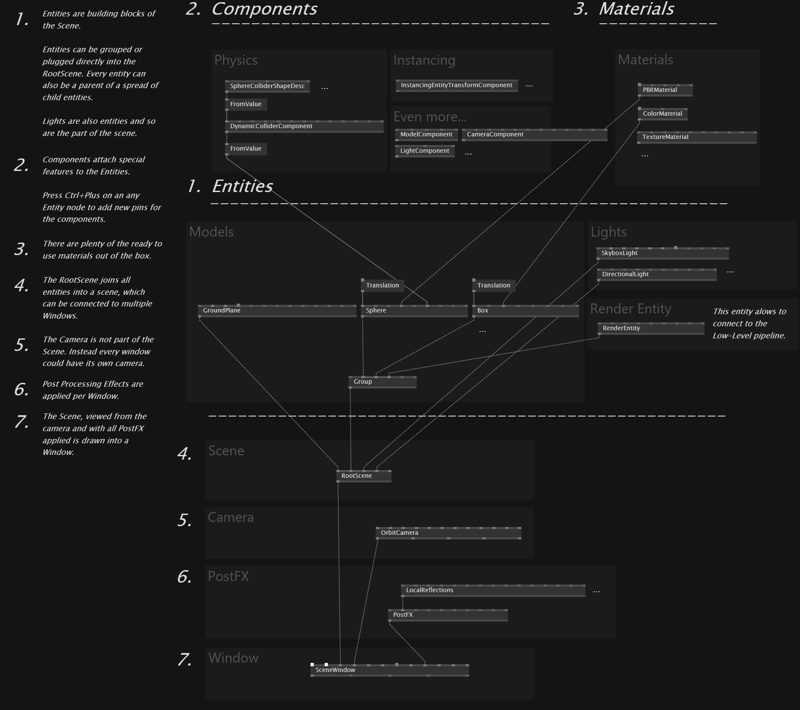

## Entities

Entities是Scene中内置的block，因而不单单是个mesh，或者是个模型，而是集成了stride引擎特征的功能块。

- Entities可以直接连接到RootScene上，或者group到RootScene上

- Entity支持父子关系的nested！

- Entity可以连接Components！

- RenderEntity是用来连接Low-Level Pipeline的节点！

## Components ！

对vvvv来说这真的是一个全新的概念。有点像比如在unity中我们可以移动某个物体，物体同时也可以添加一个脚本自己运行，也可以被另外一个系统（比如物理系统）所控制。这就是作为一个游戏引擎的厉害的地方，这个部分要专门学习，感觉会有很多可能性。

## Materials

## Scene

## Camera

## PostFX

## Window

其他的就是常规了。值得一提的是Camera不属于Scene，每个Window都有自己的一个Camera。

感觉下来，vvvv想要充分利用引擎的那部分解决方案，这样真的可以成为某种生产力工具。同样的一个需求，就会有很多种途径在很多个层面去解决。