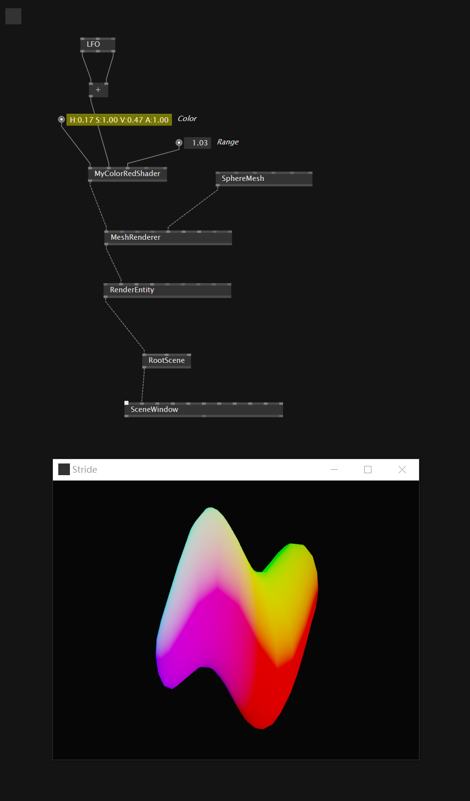

因为gamma中关于shader的教程还没很多，但同时其实gamma底层还是stride引擎。因而我们多了解一点在stride中shader的写法同样就能运用到vvvv中。

理解SDSL最重要的一点似乎是它对于数据传输的理解，也就是stream variable。查看这个[文档](https://doc.stride3d.net/4.0/en/manual/graphics/effects-and-shaders/shading-language/automatic-shader-stage-input-output.html)

```hlsl
[Summary("Draws geometry in the given color.")]
shader MyColorRed_DrawFX : VS_PS_Base
{
    [Color]
    float4 Color = float4(1, 1, 1, 1);
    float value = 0;
    float Range = 1;

    stream float4 pos : POSITION;
    stream float3 normal : NORMAL;

    override stage void VSMain()
    {
        streams.Position.y += sin(streams.Position.z * 10 + value) * 0.2;
        streams.ShadingPosition = mul(streams.Position, WorldViewProjection);

    }

    override stage void PSMain() 
    {
        streams.Depth = 1;
        streams.ColorTarget = float4(streams.normal,1);
    }
};
```



方便地将参数传入shader，同时也方便地将normal信息传入PS。