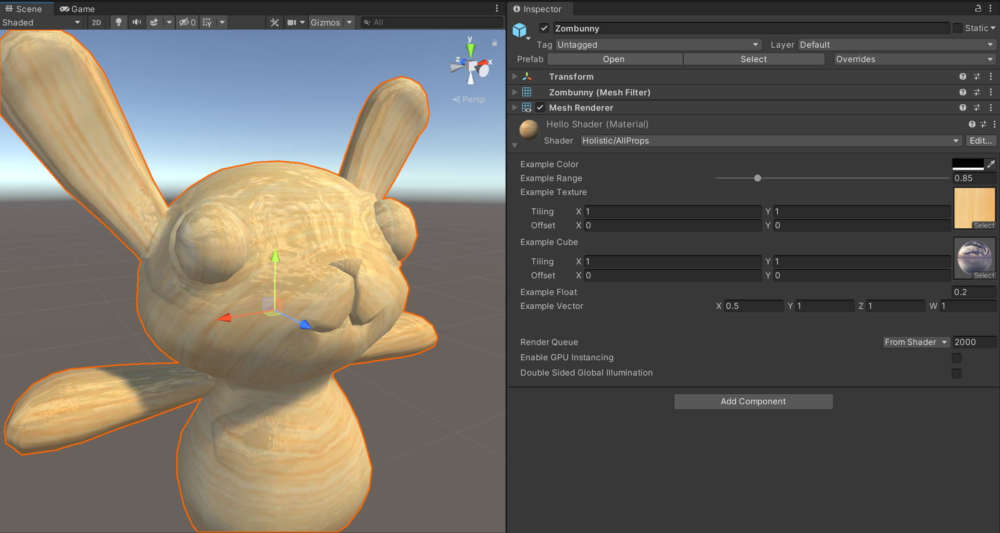

# basic 2



## Cube map

```shaderlab
Properties{
    _myCube("Example Cube", CUBE)=""{}
}
```

假设我开放一个接口给cube texture，发现并不能引入jpg或者png等等的图片，似乎是特殊格式。下载了几个asset store中的package试了一下，发现似乎支持.exr后缀的文件以及.hdr的文件。
但是我直接把文件引入，又不能直接添加到cube texture上，好像必须通过unity的什么处理，今后再细细研究。

```shaderlab
void surf (Input IN, inout SurfaceOutput o) {
        o.Emission = texCUBE (_myCube, IN.worldRefl).rgb;
    }
```
通过👆将CUBE，在worldRefl的帮助下贴到Emisson上。

## Texture

```shaderlab
void surf (Input IN, inout SurfaceOutput o) {
    o.Albedo = tex2D(_myTex, IN.uv_myTex).rgb;
}

```

```shaderlan
void surf (Input IN, inout SurfaceOutput o) {
    o.Albedo = (tex2D(_myTex, IN.uv_myTex)* _myRange).rgb;

}
```
引入_myRange可以做实时调节

## all code

```shaderlab
Shader "Holistic/AllProps" 
{
    Properties {
        _myColor ("Example Color", Color) = (1,1,1,1)
        _myRange ("Example Range", Range(0,5)) = 1
        _myTex ("Example Texture", 2D) = "white" {}
        _myCube ("Example Cube", CUBE) = "" {}
        _myFloat ("Example Float", Float) = 0.5
        _myVector ("Example Vector", Vector) = (0.5,1,1,1)
    }
    SubShader {

      CGPROGRAM
        #pragma surface surf Lambert
        
        fixed4 _myColor;
        half _myRange;
        sampler2D _myTex;
        samplerCUBE _myCube;
        float _myFloat;
        float4 _myVector;

        struct Input {
            float2 uv_myTex;
            float3 worldRefl;
        };
        
        void surf (Input IN, inout SurfaceOutput o) {
            o.Albedo = (tex2D(_myTex, IN.uv_myTex)* _myRange).rgb;
            o.Emission = (texCUBE(_myCube, IN.worldRefl)* _myFloat).rgb;
        }
      
      ENDCG
    }
    Fallback "Diffuse"
  }

```
