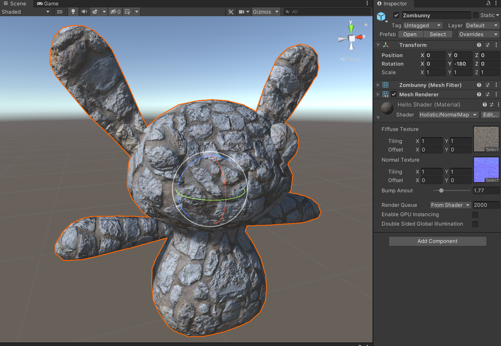

# Normal Map


Lambert材质遵循着最简单的呈现一个面的逻辑，就是法线与视线夹角的关系，从而展现出3D模型的明暗关系。
发现贴图则就是在其中耍了一个小聪明。
```shaderlab
Shader "Holistic/NormalMap"
{
    Properties
    {
        _myDiffuse ("Fiffuse Texture", 2D) = "white"{}
        _myNormal ("Normal Texture", 2D) = "white"{}
        _mySlider("Bump Amout", Range(0,10)) = 1
    }
    SubShader
    {
        CGPROGRAM
        #pragma surface surf Lambert

        sampler2D _myDiffuse;
        sampler2D _myNormal;
        float _mySlider;

        struct Input {
            float2 uv_myDiffuse;
            float2 uv_myNormal;

        };

        void surf(Input IN, inout SurfaceOutput o) {
            o.Albedo = tex2D(_myDiffuse, IN.uv_myDiffuse).rgb;
            o.Normal = UnpackNormal(tex2D(_myNormal, IN.uv_myNormal));
            o.Normal *= float3(_mySlider, _mySlider, 1);
        }

      ENDCG
    }
    FallBack "Diffuse"
```

- 注意这里
```shaderlab
o.Normal = UnpackNormal(tex2D(_myNormal, IN.uv_myNormal));
```
就是得用unity内置的UnpackNormal函数去解这个图的信息才能准确现实法线贴图。