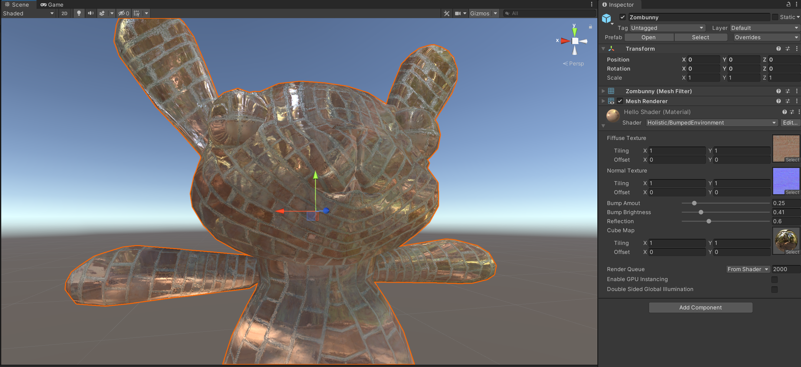
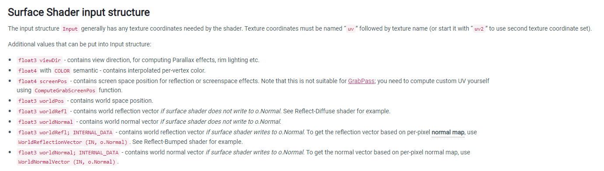
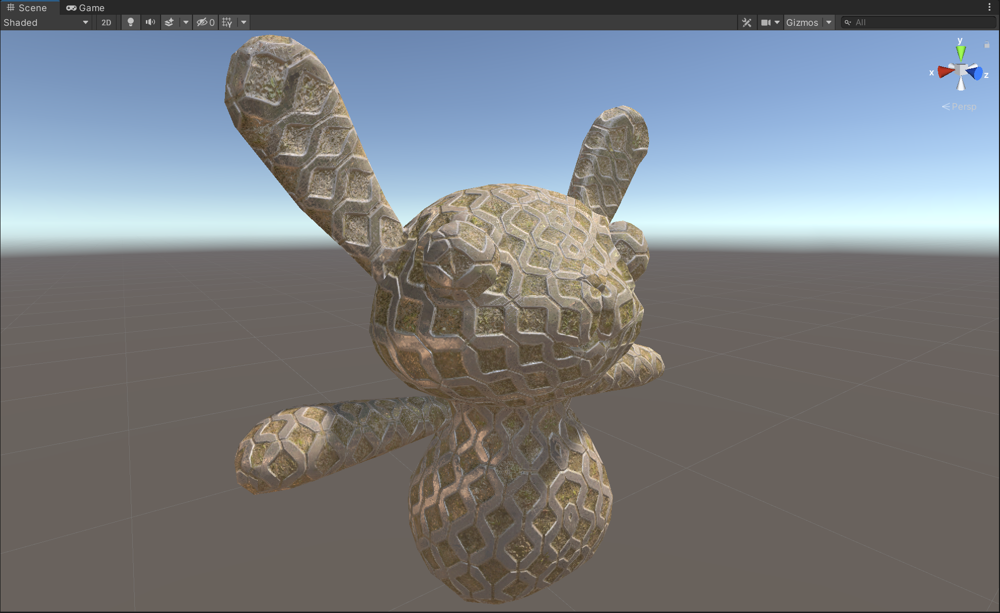

# Normal Map


Lambert材质遵循着最简单的呈现一个面的逻辑，就是法线与视线夹角的关系，从而展现出3D模型的明暗关系。
发现贴图则就是在其中耍了一个小聪明。
```shaderlab
Shader "Holistic/NormalMap"
{
    Properties
    {
        _myDiffuse ("Fiffuse Texture", 2D) = "white"{}
        _myNormal ("Normal Texture", 2D) = "white"{}
        _mySlider("Bump Amout", Range(0,10)) = 1
    }
    SubShader
    {
        CGPROGRAM
        #pragma surface surf Lambert

        sampler2D _myDiffuse;
        sampler2D _myNormal;
        float _mySlider;

        struct Input {
            float2 uv_myDiffuse;
            float2 uv_myNormal;

        };

        void surf(Input IN, inout SurfaceOutput o) {
            o.Albedo = tex2D(_myDiffuse, IN.uv_myDiffuse).rgb;
            o.Normal = UnpackNormal(tex2D(_myNormal, IN.uv_myNormal));
            o.Normal *= float3(_mySlider, _mySlider, 1);
        }

      ENDCG
    }
    FallBack "Diffuse"
```

- 注意这里
```shaderlab
o.Normal = UnpackNormal(tex2D(_myNormal, IN.uv_myNormal));
```
就是得用unity内置的UnpackNormal函数去解这个图的信息才能准确现实法线贴图。

# Bumped Reflection



如果一个物体上有了凹凸，应该不止体现在光影上，也应该体现在反射上，就会显得更加真实。换句话说，就是发现贴图的数据也应该体现在Reflection，也就是使用在环境贴图+Emission上。

两点注意
```shaderlab
o.Emission = (texCUBE(_myCube, WorldReflectionVector(IN, o.Normal))* _myRefl).rgb;
```
第一点就是这里的内置函数 WorldReflectionVector(IN, o.Normal),虽然不知道为什么这么写，但是基本上明白了这里就是将法线作为引入了反射世界，合成了新的反射Vector。

```shaderlab
struct Input {
    ...
    float3 worldRefl; INTERNAL_DATA
}
```

第二点就是这里引入worldRefl的时候后边得加一句INTERNAL_DATA，否则系统会报错。猜测是是因为通过法线贴图实际上改变了worldRefl，系统不知道是引入哪一个。

参见[官方手册](https://docs.unity3d.com/Manual/SL-SurfaceShaders.html)



这样就能做出蛮逼真的效果了




```shaderlab
Shader "Holistic/BumpedEnvironment"
{
    Properties
    {
        _myDiffuse("Fiffuse Texture", 2D) = "white"{}
        _myNormal("Normal Texture", 2D) = "white"{}

        _mySlider("Bump Amout", Range(0,2)) = 1
        _myBright("Bump Brightness", Range(0,2)) = 1
        _myRefl("Reflection", Range(0,2)) = 1

        _myCube("Cube Map", CUBE)="white"{}
    }
        SubShader
        {
            CGPROGRAM
            #pragma surface surf Lambert

            sampler2D _myDiffuse;
            sampler2D _myNormal;
            float _mySlider;
            float _myBright;
            float _myRefl;
            samplerCUBE _myCube;

            struct Input {
                float2 uv_myDiffuse;
                float2 uv_myNormal;
                float3 worldRefl; INTERNAL_DATA
            };

            void surf(Input IN, inout SurfaceOutput o) {
                o.Albedo = tex2D(_myDiffuse, IN.uv_myDiffuse).rgb;
                o.Normal = UnpackNormal(tex2D(_myNormal, IN.uv_myNormal))*_myBright;
                o.Normal *= float3(_mySlider, _mySlider, 1);
                o.Emission = (texCUBE(_myCube, WorldReflectionVector(IN, o.Normal))* _myRefl).rgb;
            }

          ENDCG
        }
            FallBack "Diffuse"
}

```